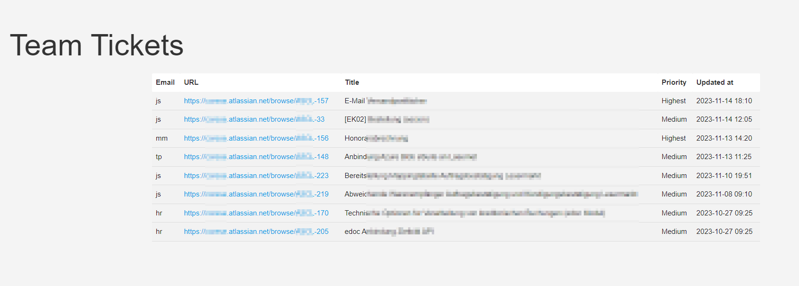

# Jira-Dashboard

## Overview

This Flask application serves as a dashboard to display Jira tickets assigned to team members. It updates the ticket information every 5 minutes and sorts them by the date of the newest update descending.



## Features

- Displays a list of Jira tickets assigned to each team member.
- Updates ticket information every 5 minutes.
- Sorts tickets by the date of assignment, with the most recent at the top.
- Provides links to the Jira issues.

## Requirements

- Python 3.9 or later
- Flask
- A Jira account with an API token

## Setup

1. Clone the repository to your local machine.
2. Navigate to the cloned directory.
3. Install the required Python packages: `pip install -r app/requirements.txt`
4. Create a `.env` file in the root directory with your Jira credentials and server information:

```text
JIRA_SERVER=https://your-jira-server.atlassian.net
EMAIL=your-email@example.com
JIRA_TOKEN=your-jira-api-token
UPDATE_INTERVAL=300 # seconds (5 minutes)
```

5. Update the `team.txt` file with the email addresses of your team members, one per line.
The `team.txt` file should contain the email addresses of the team members whose tickets you want to display on the dashboard. Each email address should be on a separate line. Here is an example of the contents of `team.txt`:

```text
member1@example.com
member2@example.com
```

## Running the Application

### With Flask

Run the application using Flask with the following command:

```bash
FLASK_APP=app/app.py flask run
```


The application will be available at `http://127.0.0.1:5000/`.

### With Docker

To run the application using Docker, ensure you have Docker and Docker-Compose installed on your system. Then run:

```bash
docker-compose up
```

Note: The `docker-compose.yml` file is set to run the application on port 5003. If you want to change the port, update the `docker-compose.yml` file:

```yaml
...
    ports:
      - "5003:5000" # Outside port: Inside port
...
```

This will build the Docker image and start the container. The application will be accessible at `http://localhost:5003/`.
